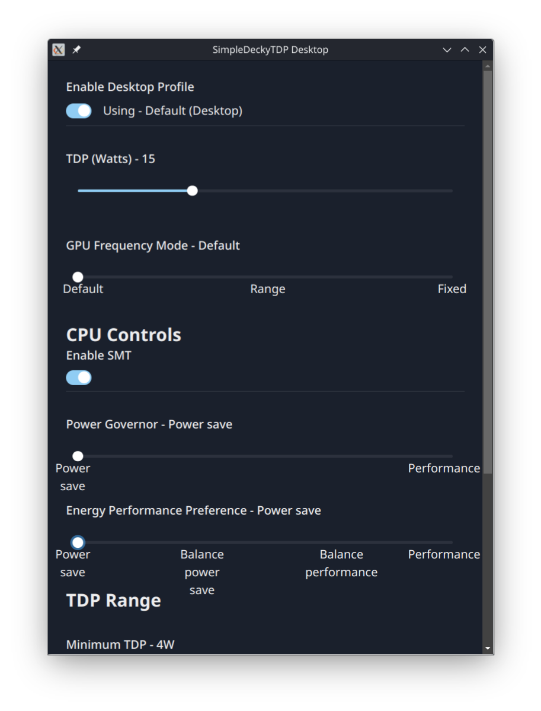

# SimpleDeckyTDP Desktop (Experimental)

An experimental desktop GUI/Frontend to the SimpleDeckyTDP Decky Plugin

Note, this requires Decky Loader + SimpleDeckyTDP to already be installed.

It also will not have feature parity with the Decky Plugin itself, see [limitations](#limitations) for more info

# Requirements

Decky Loader and SimpleDeckyTDP already installed

# Limitations

Note, the Desktop app does not have full feature parity with the Decky Plugin. **Certain features cannot be implemented**, such as:

- per-game profiles
- set TDP on resume
- TDP polling
- etc

It also should not be used simultaneously with the SimpleDeckyTDP decky plugin, you should only use one or the other at any given time.

# Installation

If not already installed, install Decky Loader + [SimpleDeckyTDP](https://github.com/aarron-lee/SimpleDeckyTDP)

Then, download the latest AppImage from [releases](https://github.com/aarron-lee/SimpleDeckyTDP-Desktop/releases) and install it via an AppImage manager like [GearLever](https://flathub.org/apps/it.mijorus.gearlever), AppImageLauncher, etc

# Attribution

favicon for icons ([cc-by4.0 license](https://creativecommons.org/licenses/by/4.0/)) - https://favicon.io/emoji-favicons/video-game
