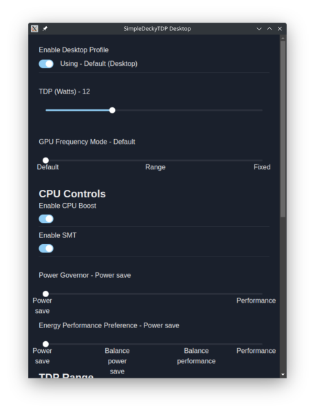

# SimpleDeckyTDP Desktop

A Desktop port of the SimpleDeckyTDP Decky Plugin, built for AMD APU devices



- [Features](#features)
- [Requirements](#requirements)
- [Limitations](#limitations)
- [Installation](#install)
- [Manual Build](#manual-build)
- [Uninstall Instructions](#uninstall-instructions)
- [Troubleshooting](#troubleshooting)
  - [Ryzenadj Troubleshooting](#ryzenadj-troubleshooting)
- [Attribution](#attribution)

## Features

- TDP controls + custom TDP Limits
- Power Governor and Energy Performance Preference controls
- GPU Controls
- Desktop tray support (AppIndicator)
  - click the tray icon to hide/show the app
- SMT control
- CPU Boost control\*
  - note, requires a newer kernel for CPU boost controls
  - CPU boost controls appear automatically if it's available on your device
- set TDP on AC Power events and suspend-resume events
  - separate AC Power Profiles supported on select devices only, see [limitations](#limitations) for more info
- TDP Polling - useful for devices that change TDP in the background
- Legion Go TDP via WMI calls (allows for TDP control with secure boot, requires acpi_call)
- ROG Ally TDP via WMI calls (allows for TDP control with secure boot)
- etc

# Requirements

- unofficial decky loader
- SDTDP decky plugin

### Other requirements

[Unofficial Decky Loader](https://github.com/aarron-lee/decky-loader) is a fork I made of Decky with the required functionality for the desktop app. Note that this can safely be used alongside regular Decky Loader without issue, they don't interfere with each other.

# Limitations

Note, the Desktop app does not have full feature parity with the Decky Plugin.

**Certain features cannot be implemented**, such as:

- per-game profiles

# Installation

If not already installed, install unofficial decky to your device

```bash
curl -L https://raw.githubusercontent.com/aarron-lee/decky-loader/main/dist/install_release.sh | sh
```

Then install SimpleDeckyTDP-Desktop and add the Desktop app

```bash
bash <(curl -fsSL https://raw.githubusercontent.com/aarron-lee/SimpleDeckyTDP-Desktop/main/install.sh)

# try this if the above command doesn't work
curl -L https://raw.githubusercontent.com/aarron-lee/SimpleDeckyTDP-Desktop/main/install_noprompt.sh | sh
```

# Manual Build

```bash
# download the repo + enter the directory in terminal

cd SimpleDeckyTDP-Desktop

npm install

npm run electron-build

cd electron

npm install

npm run build

# appImage file will be generated in the electron/dist directory
```

# Uninstall Instructions

1. delete the appImage via whatever appImage manager you happen to be using
2. uninstall unofficial decky: `curl -L https://raw.githubusercontent.com/aarron-lee/decky-loader/main/dist/uninstall.sh | sh`
3. Delete any remaining files `sudo rm $HOME/.unofficial_homebrew`

# Attribution

favicon for icons ([cc-by4.0 license](https://creativecommons.org/licenses/by/4.0/)) - https://favicon.io/emoji-favicons/video-game
